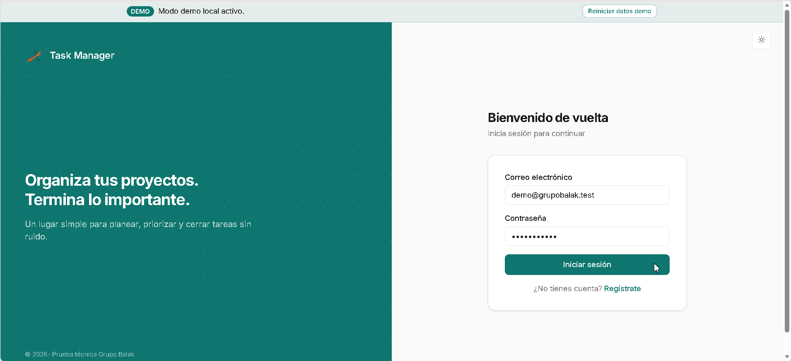
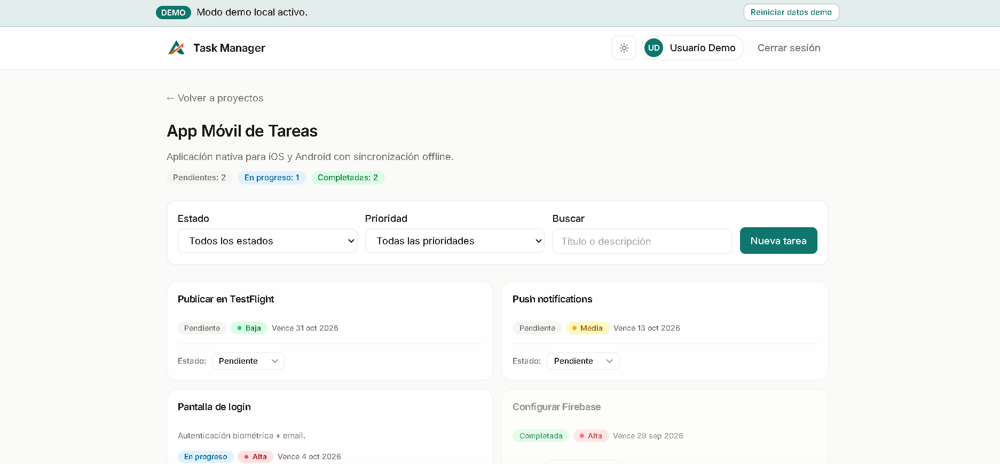
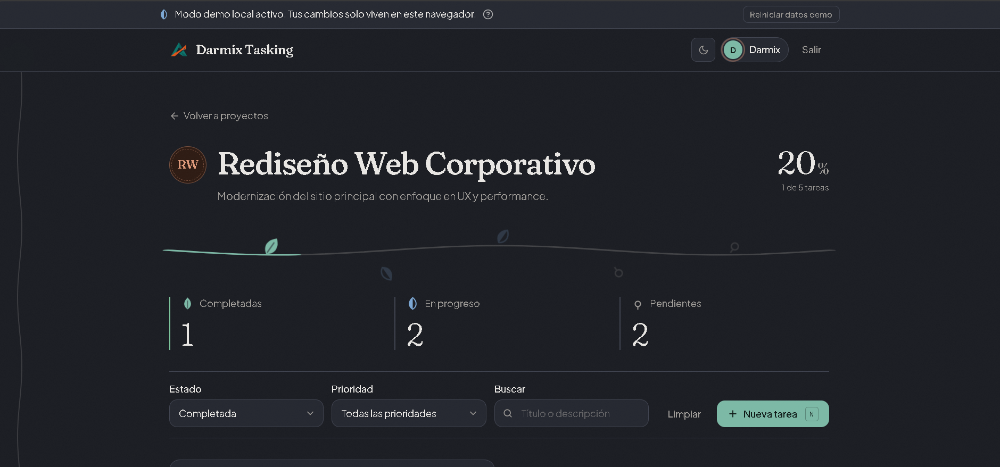
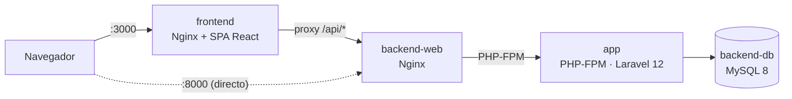

<div align="center">


# Task Manager

Aplicación web para gestionar proyectos y tareas: API RESTful con **Laravel 12** y **JWT**, y SPA en **React 19** con **Tailwind CSS**.


[Backend](backend/README.md) · [Frontend](frontend/README.md) · [🌐 Ver Demo Online](https://grupo-balak-task-manager.pages.dev/) · [Inicio rápido](#inicio-rápido-con-docker)

<br>



</div>

---

## Tabla de contenidos

1. [Descripción](#descripción)
2. [Capturas](#capturas)
3. [Arquitectura](#arquitectura)
4. [Estructura del repositorio](#estructura-del-repositorio)
5. [Inicio rápido con Docker](#inicio-rápido-con-docker)
6. [Servicios y puertos](#servicios-y-puertos)
7. [Ejecución sin Docker](#ejecución-sin-docker)
8. [Credenciales de prueba](#credenciales-de-prueba)
9. [Variables de entorno](#variables-de-entorno)
10. [Comandos útiles](#comandos-útiles)
11. [Tests](#tests)
12. [Solución de problemas](#solución-de-problemas)
13. [Cobertura de requisitos](#cobertura-de-requisitos)
14. [Documentación detallada](#documentación-detallada)

---

## Descripción

Task Manager permite a cada usuario organizar su trabajo en **proyectos** y **tareas**, con estado y prioridad.

- **Autenticación JWT:** registro, login, logout y renovación de token (refresh).
- **Proyectos y tareas:** CRUD completo, con acceso restringido a los datos del propio usuario.
- **Filtros y búsqueda:** por estado, prioridad y texto, con paginación del lado del servidor.
- **Interfaz responsive** con tema claro, oscuro y de sistema.
- **Resiliencia:** aviso de pérdida de conexión y **modo demo local** que permite usar la interfaz aunque el backend no esté disponible.
- **Calidad:** validaciones con Form Requests, respuestas con API Resources, manejo global de errores, políticas de autorización y tests automatizados en ambas partes.

---

## Capturas

<table>
  <tr>
    <td align="center"><b>Tema claro</b></td>
    <td align="center"><b>Tema oscuro</b></td>
  </tr>
  <tr>
    <td></td>
    <td></td>
  </tr>
</table>

---

## Arquitectura



Los cuatro servicios comparten la red `task_manager_net`, definida en `docker-compose.yml`. El frontend sirve el SPA y reenvía `/api/*` al backend, de modo que el navegador usa un único origen (sin CORS).

---

## Estructura del repositorio

```text
grupo-balak-task-manager/
├── backend/                # API Laravel 12 + JWT (ver backend/README.md)
│   ├── app/
│   ├── database/
│   ├── docker/nginx/       # Configuración de Nginx del backend
│   ├── routes/api.php
│   ├── tests/
│   └── Dockerfile
├── frontend/               # SPA React 19 + Vite (ver frontend/README.md)
│   ├── src/
│   ├── nginx.conf
│   └── Dockerfile
├── docs/assets/            # Logo, capturas y GIF de este README
├── docker-compose.yml      # Orquesta base de datos, backend y frontend
├── .env.example            # Credenciales de la base de datos para Docker
└── README.md
```

---

## Inicio rápido con Docker

Levanta todo el sistema (base de datos, API y frontend) con Docker.

**Requisitos:** [Git](https://git-scm.com/) y [Docker Desktop](https://www.docker.com/products/docker-desktop/) (incluye Docker Compose v2). No necesitas PHP, Composer, Node ni MySQL instalados.

**1. Clonar el repositorio:**

```bash
git clone https://github.com/OrlandoGalvanVargas/grupo-balak-task-manager.git
```

**2. Entrar a la carpeta del proyecto:**

```bash
cd grupo-balak-task-manager
```

**3. Construir y levantar los contenedores:**

```bash
docker compose up -d --build
```

> **Nota:** La primera vez, la construcción de las imágenes y la configuración del backend tardarán unos minutos (mientras instala dependencias y levanta la base de datos).

**4. Comprobar que todos los servicios están en ejecución:**

```bash
docker compose ps
```

**5. Verificar que la API responde:**

```bash
curl http://localhost:8000/api/ping
```

Respuesta esperada:

```json
{
  "success": true
}
```

**6. Abrir la aplicación** e iniciar sesión con las [credenciales de prueba](#credenciales-de-prueba):

```text
http://localhost:3000
```

> **Aviso sobre el Modo Local / Demo:** Si abres el frontend inmediatamente después de ejecutar el comando de Docker, es posible que notes que funciona temporalmente en **modo local** o muestre algún aviso de demo porque el backend aún se está terminando de configurar en segundo plano. Una vez que veas que los contenedores ya están listos (paso 4 y 5), simplemente refresca la página (`Ctrl + F5`) para que se conecte correctamente con la API del backend y desaparezca el modo local.

---

## Servicios y puertos

| Servicio      | Contenedor                 | Descripción                                    | Acceso desde el equipo      |
| ------------- | -------------------------- | ---------------------------------------------- | --------------------------- |
| `frontend`    | `task_manager_frontend`    | Nginx con el SPA de React y proxy hacia `/api` | `http://localhost:3000`     |
| `backend-web` | `task_manager_backend_web` | Nginx del backend (entrada a Laravel)          | `http://localhost:8000/api` |
| `app`         | `task_manager_backend_app` | PHP-FPM con Laravel 12                         | Solo red interna            |
| `backend-db`  | `task_manager_backend_db`  | MySQL 8                                        | `localhost:3307`            |

El puerto de MySQL es **3307** (y no 3306) para no chocar con un MySQL o XAMPP instalado en el equipo. Para conectarte con un cliente como DBeaver o phpMyAdmin usa el host `127.0.0.1`, el puerto `3307` y las credenciales del archivo `.env` (por defecto `root` / `root`). Esas credenciales son solo para desarrollo.

La API también es accesible a través del frontend, que la reenvía:

```text
http://localhost:3000/api/ping
```

---

## Ejecución sin Docker

Cada parte puede ejecutarse directamente en tu equipo. Las instrucciones completas están en cada README:

| Parte    | Requisitos                                               | Guía                                                                              |
| -------- | -------------------------------------------------------- | --------------------------------------------------------------------------------- |
| Backend  | PHP 8.2+, Composer 2, MySQL/MariaDB (por ejemplo, XAMPP) | [Instalación local del backend](backend/README.md#instalación-local-xampp--mysql) |
| Frontend | Node.js 20.19+ o 22.12+                                  | [Instalación local del frontend](frontend/README.md#instalación-local)            |

Combinaciones recomendadas: **ambos en Docker** (esta guía) o **ambos locales**. Un frontend local también funciona contra el backend en Docker, porque la API se publica en el puerto 8000. Si el frontend no encuentra el backend, entra en modo demo (ver el [README del frontend](frontend/README.md#modos-de-operación)).

---

## Credenciales de prueba

El seeder crea dos usuarios, también disponibles en el modo demo del frontend:

| Usuario      | Email                  | Contraseña    | Descripción                                                      |
| ------------ | ---------------------- | ------------- | ---------------------------------------------------------------- |
| Usuario Demo | `demo@grupobalak.test` | `password123` | Usuario principal con proyectos y tareas de ejemplo              |
| Otro Usuario | `otro@grupobalak.test` | `password123` | Usuario secundario, para comprobar el aislamiento entre usuarios |

---

## Variables de entorno

| Archivo                 | Uso                                                    | Contenido                                                             |
| ----------------------- | ------------------------------------------------------ | --------------------------------------------------------------------- |
| `.env` (raíz, opcional) | Credenciales de MySQL para Docker Compose              | `DB_DATABASE`, `DB_USERNAME`, `DB_PASSWORD`                           |
| `backend/.env`          | Configuración de Laravel (clave de la app, JWT, caché) | Ver [variables del backend](backend/README.md#variables-de-entorno)   |
| `frontend/.env`         | Configuración del frontend en desarrollo local         | Ver [variables del frontend](frontend/README.md#variables-de-entorno) |

Con Docker, `docker-compose.yml` sobrescribe la conexión a la base de datos del contenedor `app` (`DB_HOST=backend-db`), por lo que el valor de `DB_HOST` en `backend/.env` no se utiliza. El frontend en Docker se compila con `VITE_API_URL=/api`, de modo que usa el proxy de Nginx; si cambias esa variable, reconstruye con `docker compose up -d --build`.

---

## Comandos útiles

Ver el estado de los servicios:

```bash
docker compose ps
```

Ver los logs de un servicio en tiempo real (`app`, `backend-web`, `backend-db` o `frontend`):

```bash
docker compose logs -f app
```

Abrir una terminal dentro del contenedor del backend:

```bash
docker compose exec app sh
```

Ejecutar cualquier comando de Artisan:

```bash
docker compose exec app php artisan route:list --path=api
```

Detener los servicios sin borrar datos:

```bash
docker compose stop
```

Volver a iniciarlos:

```bash
docker compose start
```

Detener y eliminar los contenedores (los datos de MySQL se conservan en el volumen `db_data`):

```bash
docker compose down
```

**Reinicio total:** elimina también el volumen de la base de datos. Después repite los pasos 5 a 9 del inicio rápido:

```bash
docker compose down -v
```

---

## Tests

**Backend** (Pest), dentro del contenedor:

```bash
docker compose exec app php artisan test
```

**Frontend** (Vitest), desde la carpeta `frontend/` con Node.js instalado:

```bash
npm test
```

Los tests del backend usan `RefreshDatabase`, que recrea las tablas. Si se ejecutan contra la misma base que usa la aplicación, **los datos de ejemplo se eliminan**. Para restaurarlos:

```bash
docker compose exec app php artisan migrate:fresh --seed
```

Más detalles en [Tests del backend](backend/README.md#tests) y [Tests del frontend](frontend/README.md#tests).

---

## Solución de problemas

| Síntoma                                                                 | Causa probable                                                        | Solución                                                                                           |
| ----------------------------------------------------------------------- | --------------------------------------------------------------------- | -------------------------------------------------------------------------------------------------- |
| El frontend muestra el banner **DEMO** aunque el backend está encendido | El modo se decide al cargar la página; el backend aún no estaba listo | Espera unos segundos, comprueba `http://localhost:8000/api/ping` y recarga con `Ctrl + F5`         |
| `502 Bad Gateway` o error 500 justo después de levantar                 | El backend aún no tiene dependencias o clave de aplicación            | Completa los pasos 7 y 8 y espera unos segundos                                                    |
| `Connection refused` o `SQLSTATE[HY000] [2002]` al migrar               | MySQL todavía se está inicializando                                   | Espera 10 a 15 segundos (confirma con `docker compose logs backend-db`) y repite el comando        |
| `Duplicate entry` al ejecutar los seeders                               | Se ejecutó `db:seed` sobre datos que ya existen en el volumen         | Usa `migrate:fresh --seed` (recrea las tablas antes de poblarlas)                                  |
| `No application encryption key has been specified`                      | Falta el `.env` del backend o la clave                                | Ejecuta los pasos 3 y 8                                                                            |
| `port is already allocated` (3000, 8000 o 3307)                         | Otro programa usa ese puerto                                          | Detén ese programa o cambia el puerto izquierdo en `docker-compose.yml` (por ejemplo, `"8080:80"`) |
| Tras ejecutar los tests ya no hay datos de ejemplo                      | Los tests recrearon las tablas                                        | Ejecuta `docker compose exec app php artisan migrate:fresh --seed`                                 |
| Los cambios del frontend no se ven en `localhost:3000`                  | La imagen del frontend es una compilación estática                    | Reconstruye con `docker compose up -d --build frontend`                                            |

---

## Cobertura de requisitos

| Requisito                                                     | Dónde verlo                                                                         |
| ------------------------------------------------------------- | ----------------------------------------------------------------------------------- |
| Migraciones y relaciones (`users`, `projects`, `tasks`)       | [Backend: arquitectura](backend/README.md#arquitectura)                             |
| Autenticación JWT: registro, login, logout y refresh          | [Backend: autenticación](backend/README.md#autenticación)                           |
| Rutas de proyectos y tareas protegidas y asociadas al usuario | [Backend: endpoints](backend/README.md#endpoints)                                   |
| CRUD de `/api/projects` y `/api/tasks`                        | [Backend: endpoints](backend/README.md#endpoints)                                   |
| Form Requests, API Resources y códigos HTTP                   | [Backend: formato de respuestas](backend/README.md#formato-de-respuestas-y-errores) |
| Filtros por `status` y `priority`                             | [Backend: endpoints](backend/README.md#endpoints)                                   |
| Eager loading (`with()`) para evitar N+1                      | [Backend: decisiones técnicas](backend/README.md#decisiones-técnicas)               |
| Pantalla de login y registro                                  | [Frontend: cobertura](frontend/README.md#cobertura-de-requisitos)                   |
| Proyectos, tareas, CRUD, cambio de estado y filtros           | [Frontend: cobertura](frontend/README.md#cobertura-de-requisitos)                   |
| Hooks, componentes reutilizables y organización de carpetas   | [Frontend: estructura](frontend/README.md#estructura-del-proyecto)                  |
| Estados de carga, vacío y error                               | [Frontend: sistema de diseño](frontend/README.md#sistema-de-diseño)                 |
| Interfaz responsive con Tailwind CSS                          | [Frontend: sistema de diseño](frontend/README.md#sistema-de-diseño)                 |
| **Extra:** tests en Laravel (Pest)                            | [Backend: tests](backend/README.md#tests)                                           |
| **Extra:** tests en frontend (Vitest)                         | [Frontend: tests](frontend/README.md#tests)                                         |
| **Extra:** paginación en el listado de tareas                 | [Frontend: consumo de la API](frontend/README.md#consumo-de-la-api)                 |
| README, variables de entorno, migraciones y seed              | Este documento y los README de cada parte                                           |
| Credenciales de prueba                                        | [Credenciales de prueba](#credenciales-de-prueba)                                   |

---

## Documentación detallada

- **[Backend](backend/README.md):** arquitectura, endpoints, autenticación JWT, formato de respuestas, tests y decisiones técnicas.
- **[Frontend](frontend/README.md):** estructura, sistema de diseño, consumo de la API, modos de operación (remoto y demo), tests y decisiones técnicas.
